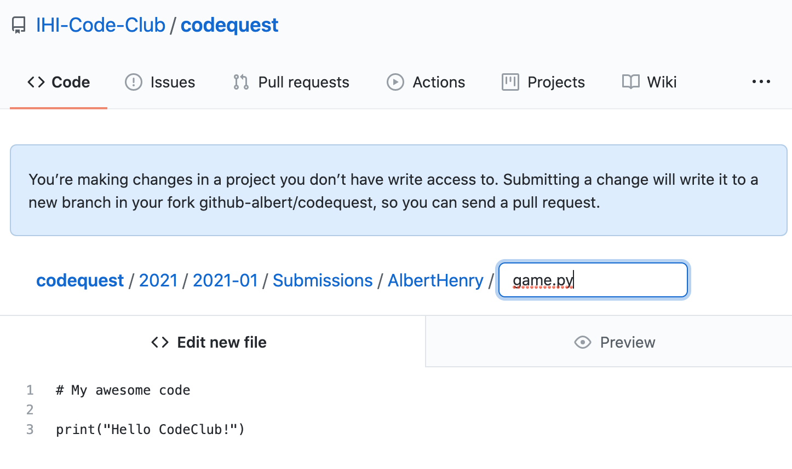
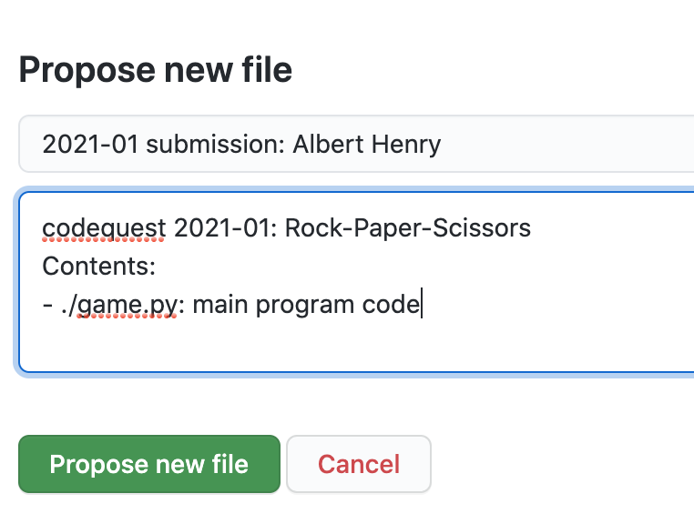
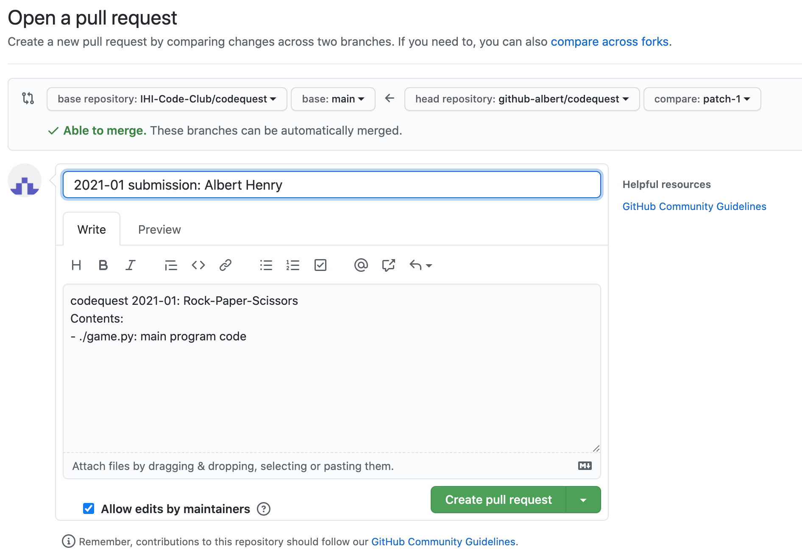

# Codequest
Monthly coding challenges organised UCL Code Club

# General rules
* Monthly, fun small-scale challenge suitable for all levels
* Each challenge has its own folder, organised in `YYYY/YYYY-MM` folders. For example, the January 2021 challenge is available on `2021/2021-01` folder. More details about the challenge can be found on the front page (`README.md`) of the folder
* Participants are expected to finish the challenges and submit before the next session
* At the end of each period, we will provide awards on the basis of:
  1. Creativity
  2. Readability
  3. Previous experience
  4. Efficiency
* Awardees are announced on the next session, and each awardee will receive £10 gift card!

# How to make a submission

Submissions are organised with GitHub [pull request](https://docs.github.com/en/github/collaborating-with-issues-and-pull-requests/about-pull-requests) feature. If you are not yet familiar with git and GitHub (_we have a [session about this](https://github.com/IHI-Code-Club/git) by the way :smile:_), the simplest way to make a submission is through GitHub website, as detailed below.

1. [Create a GitHub account](https://docs.github.com/en/github/getting-started-with-github/signing-up-for-github), if you haven't had one already.

2. Go to the `Submissions` subfolder inside the `codequest` monthly challenge folders, e.g. [`2021/2021-01/Submissions`]([2021/2021-01/Submissions).

3. Click `Add file`, create a new folder and file with the format: `YourName/file`, e.g. `TerezaMasonou/game.py`. _Note_: folder will be created automatically when you type forward slash `/`.

4. Copy and paste your code in the text editor.

5. Scroll down the page where it says _Propose new file_, input a _title_ and a _short description_ about your submission.

6. Click the green __Propose new file__ button when done, which should redirect you to the _Open pull request_ page.

7. Edit title and description of your pull request (default is the same as input from previous step), click the green __Create pull request__ button when done.

8. DONE! Check the [`codequest` pull requests tab](https://github.com/IHI-Code-Club/codequest/pulls) to see if your submission (pull request) has been successfully created.

# Monthly Coding Challenges

| Title                                                                                    | Period       | Programming language |
|------------------------------------------------------------------------------------------|--------------|----------------------|
| [Rock-Paper-Scissors](https://github.com/IHI-Code-Club/codequest/tree/main/2021/2021-01) | January 2021 | Python               |
